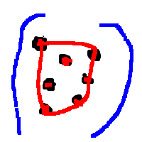

# 2-D Image Segmentation using Graph Cuts

This project implements the Ford-Fulkerson max-flow min-cut algorithm and applied it for the segmentation of a 2-D colored image. These segmentation is based on the maximum a posteriori estimation which can be reformulated as a network flow problem.

# Introduction

In this project, we applied the Ford-Fulkerson maximum-flow minimum-cut algorithm to get the image segmentation of a 2-D colored image. The purpose of the segmentation is to track which are object and which are background in the image.

I used [this paper](https://www.csd.uwo.ca/~yboykov/Papers/ijcv06.pdf) by Boykov and Funka-Lea as the main reference for this implementation.

# Implementation

## Flow Network

A flow network (also known as a transportation network) is a directed graph where each edge has a capacity and each edge receives a flow.    
A flow network typically has 2 special nodes, a source and a sink. A source is a node where the flow starts, i.e. flows out of the source,    
and a sink is a node that ends the flow, the flow goes in the sink. It is helpful to think of the edges as a pipe and flow as water. A flow network can be denoted as $G = (V, E, s, t)$, where $V$ is the set of vertices, $E$ is the set of edges, the source $s$, and the sink $t$. $f(u, v)$ denotes the flow from vertice $u$ to $v$ and $c(u, v)$ denote the capacity of edge $(u, v)$

Every flow network satisfies these 2 conditions:

1. Capacity constraint  
   The flow on each edge must be less than the capacity of the edge, i.e. $f(u, v) \leq c(u, v)$ for each edge $(u, v)$

2. Flow conservation constraint  
   The total net flow entering a node $v$ is zero for all nodes in the network except the source $s$ and the sink $t$. Mathematically, it can be expressed as  
   $$\sum\limits_{(u, v) \in E} f(u, v) = \sum\limits_{(v, w) \in E} f(v, w)$$  
   for each vertex $v \in V \setminus \{s, t\}$

## Min-cut and Image segmentation

An s-t cut is a partition $(A, B)$ of $V$ with $s \in A$ and $t \in B$. The capacity of a cut $(A, B)$ is defined as the sum of the capacity of edges that it severs

$$cap(A, B) = \sum\limits_{e \text{ out of } A} c(e)$$

The minimum cut correspond to a cut such that has the minimum capacity among all possible cuts.

Let $A = \{A_0, A_1, ..., A_n\}$ be the set of pixels in the image. Consider the following energy function
$$E(A) = \lambda \cdot R(A) + B(A)$$
defined in [the paper](https://www.csd.uwo.ca/~yboykov/Papers/ijcv06.pdf). The set of pixels that has the minimum energy function is the best possible segmentation given the constraints. By constructing a specific flow network, we can calculate a min-cut that is exactly the minimum energy function.

## Image -> Flow Network

The authors of the paper describe in great detail how to construct the flow network based on an image. The implementation follows the paper closely.

First, we convert the pixels into a vertex called voxels. Let $P$ be the set of voxels. We also create 2 extra invisible vertex, the source $s$ and sink $t$. These voxels would have edges to other voxels, $s$ and $t$. The edges from a voxel to 4 neighboring voxels are called n-links, while the edges $(s, v)$ and $(v, t)$ are called t-links. Let $N$ be the set of links $(p, q)$ that are neighbors.

The capacity of the n-link $(p, q)$ is defined as
$$B_{p, q} = 10 \cdot exp\left(\frac{-(I_p - I_q)^2}{2\sigma^2}\right)$$

The capacity of the t-link $(s, p)$ is defined as
- $K$ if $p$ is in the object seed.
- 0 if $p$ is in background seed
- $R_p(bkg)$

The capacity of the t-link $(p, t)$ is defined as
- $K$ if $p$ is in background seed
- 0 if $p$ is in object seed
- $R_p(obj)$

where
- $K = 1 + \max\limits_{p \in P}\sum\limits_{(p, q) \in N} B_{p, q}$
- $R_p"bkg) = -\ln(\Pr(I_p |bkg))$
- $R_p(obj) = -\ln(\Pr(I_p |obj))$

$R_p$ is defined using the seeds given by the user. We construct an intensity histogram of the pixels in the seeds, keeping track of how many times the intensity appears in the seed. Then, we can calculate the probability of each intensity by $\frac{   \text{count}(I_p)}{\text{seedSize}      }$. We further improve this by increasing the count of the intensity and the intensities surrounding it.


## Algorithm

The implementation of the Ford Fulkerson algorithm follows the [page](https://algs4.cs.princeton.edu/64maxflow/)  closely. The runtime of Ford Fulkerson might not be the most suitable for this problem, therefore it is relatively slow for larger images.

# Usage

The program asks for the user's image file name, displays it, and asks the user to color which are objects and which are background. Based on the user's drawn area, we use that to create a seed for object pixels and background pixels. We will use the seeds to indicate which pixels are more likely to be an object and background. Then, the program will save the seeded image and the new image that has been segmented where area indicated as the object is colored with red.

To run the program, do the following  
``` $ ./gradlew build $ ./gradlew run ```
# Results

Smaller images with dimensions under 50x50 pixels get processed quickly in less than 5 seconds. While images with dimensions around 200x200 pixels gets processed in around 3 minutes. Bigger images with dimensions above 400x400 takes cannot get processed within a reasonable amount of time. The majority of the processing time is contributed by the Ford-Fulkerson algorithm. Future improvements would consider using faster and more suitable algorithms for calculating min-cut with big capacities like the push-relabel algorithm. Improvements can also be made for calculating the intensity histogram to be more accurate with the regional term.

  
\  
*donut*

  
\  
*big dots*

  
\  
*person*
